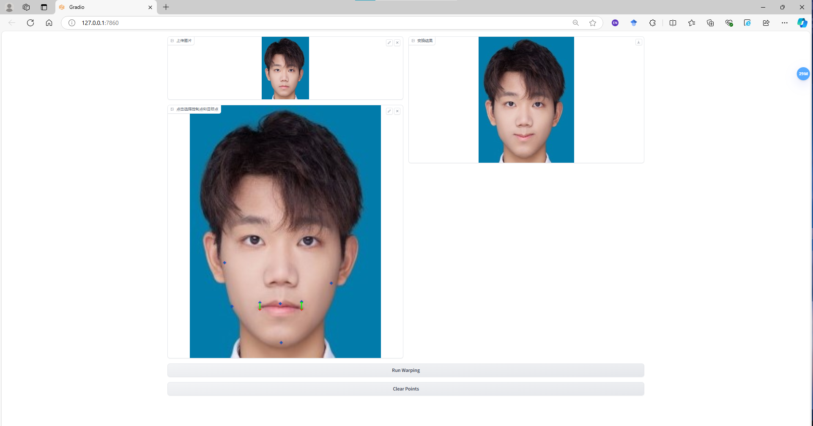

# 作业 1 - 图像变形

### 在本次作业中，您将实现图像的基本变换和基于点的变形。

### Resources:
- [Teaching Slides](https://rec.ustc.edu.cn/share/afbf05a0-710c-11ef-80c6-518b4c8c0b96) 
- [Paper: Image Deformation Using Moving Least Squares](https://people.engr.tamu.edu/schaefer/research/mls.pdf)
- [Paper: Image Warping by Radial Basis Functions](https://www.sci.utah.edu/~gerig/CS6640-F2010/Project3/Arad-1995.pdf)
- [OpenCV Geometric Transformations](https://docs.opencv.org/4.x/da/d6e/tutorial_py_geometric_transformations.html)
- [Gradio: 一个好用的网页端交互GUI](https://www.gradio.app/)

### 1. 基本图像几何变换（缩放/旋转/平移）。
Fill the [Missing Part](run_global_transform.py#L21) of 'run_global_transform.py'.


### 2. 基于点的图像变形。

Implement MLS or RBF based image deformation in the [Missing Part](run_point_transform.py#L52) of 'run_point_transform.py'.

---

## Implementation of Image Geometric Transformation

This repository is Yudong Guo's implementation of Assignment_01 of DIP. 



## Requirements

To install requirements:

```setup
python -m pip install -r requirements.txt
```


## Running

To run basic transformation, run:

```basic
python run_global_transform.py
```

To run point guided transformation, run:

```point
python run_point_transform.py
```

## Results (need add more result images)
### Basic Transformation


### Point Guided Deformation:


## Acknowledgement

>📋 Thanks for the algorithms proposed by [Image Deformation Using Moving Least Squares](https://people.engr.tamu.edu/schaefer/research/mls.pdf).
