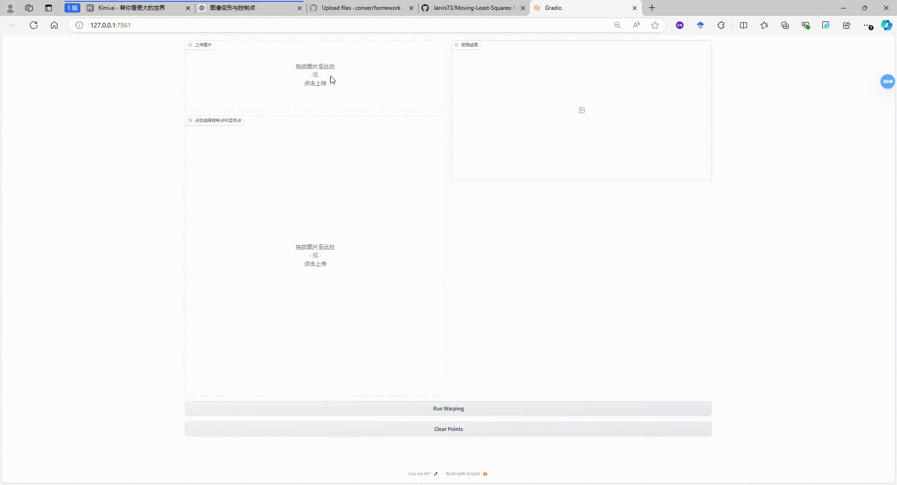

# 作业 1 - 图像变形

### 在本次作业中，您将实现图像的基本变换和基于点的变形。

### Resources:
- [Teaching Slides](https://rec.ustc.edu.cn/share/afbf05a0-710c-11ef-80c6-518b4c8c0b96) 
- [Paper: Image Deformation Using Moving Least Squares](https://people.engr.tamu.edu/schaefer/research/mls.pdf)
- [Paper: Image Warping by Radial Basis Functions](https://www.sci.utah.edu/~gerig/CS6640-F2010/Project3/Arad-1995.pdf)
- [OpenCV Geometric Transformations](https://docs.opencv.org/4.x/da/d6e/tutorial_py_geometric_transformations.html)
- [Gradio: 一个好用的网页端交互GUI](https://www.gradio.app/)

### 1. 基本图像几何变换（缩放/旋转/平移）。


### 2. 基于点的图像变形。

Implement MLS or RBF based image deformation in the [Missing Part](run_point_transform.py#L52) of 'run_point_transform.py'.

---


## 要求

要安装要求：

```安装
python -m pip install -r requirements.txt
```

## 运行

要运行基本转换，请运行：

```basic
python run_global_transform.py
```

要运行点引导变换，请运行：

```point
python run_point_transform.py
```

## 结果（需要添加更多结果图像）
### 基本变换


### 点引导变形：


##  致谢

>📋 感谢[Image Deformation Using Moving Least Squares](https://people.engr.tamu.edu/schaefer/research/mls.pdf)提出的算法.
