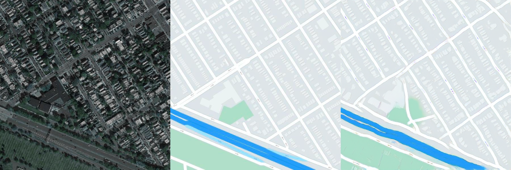
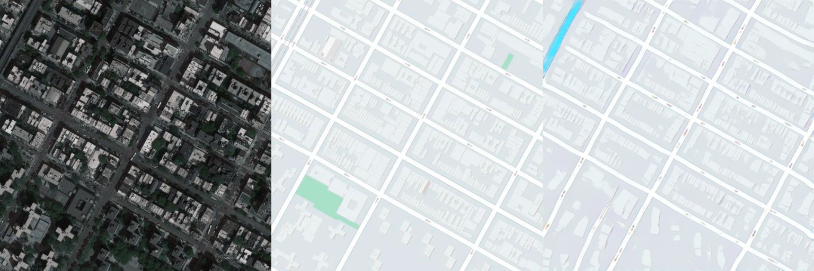
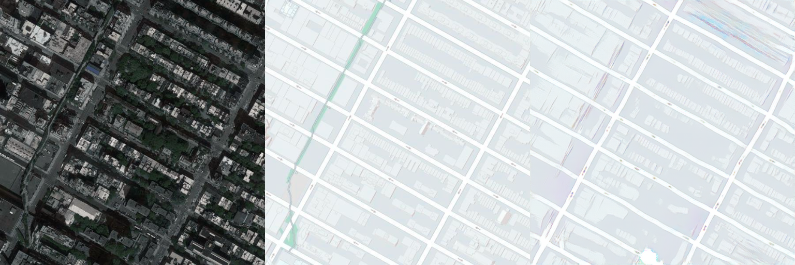
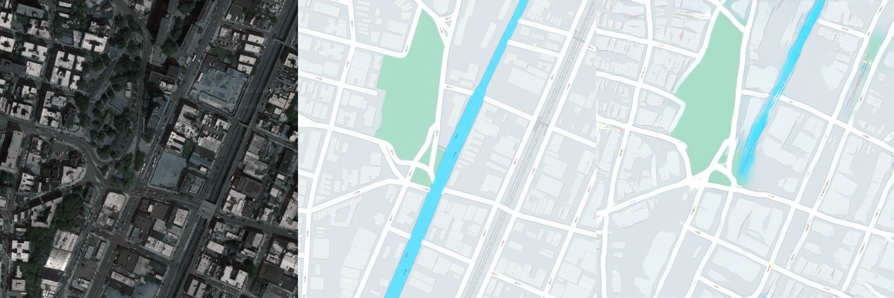
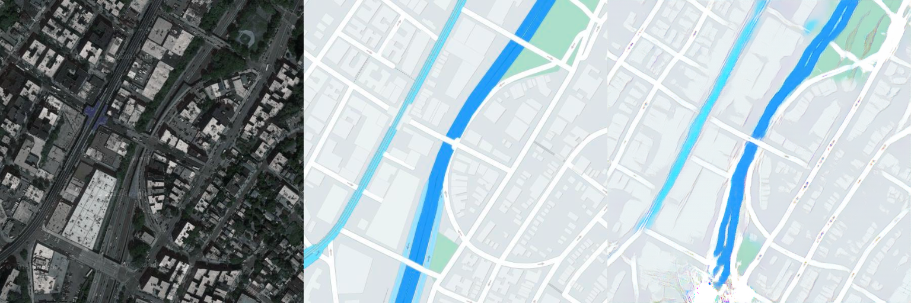

# Image Semantic Segmentation Based on Pix2Pix + GAN
This experiment combines Pix2Pix and GAN to achieve image semantic segmentation.

## Explanation of Hyperparameters
The hyperparameters used for training are as follows:

### Learning Rate:
The learning rate of the Generator: 0.002
The learning rate of the Discriminator: 0.001

### Optimizer:
The Adam optimizer, betas = (0.5, 0.999), weight_decay = 1e - 5

### Learning Rate Scheduler:
StepLR, every 100 epochs, the learning rate decays to half of the original

### Loss Function:
The loss of the Generator includes the adversarial loss (GAN Loss) and the L1 loss (L1 Loss, multiplied by a weight of 50)
The loss of the Discriminator (GAN Loss)

### Batch Size: 16

### Number of Training Epochs: 200

### Weight Decay: 1e - 5

### Experimental Dataset
The dataset used in the experiment is facades. The download script for the dataset is in download_facades_dataset.sh.
## Generator
In the generator, the input image passes through six downsampling layers, then through an intermediate layer, and finally through six upsampling layers to obtain the final output. Here, the structure of U-Net is used, that is, the output of each downsampling layer and its corresponding upper layer are concatenated together and used as the input of the next downsampling layer.
The core code is as follows:
```
class FullyConvNetwork(nn.Module):
    def __init__(self):
        super(FullyConvNetwork, self).__init__()

        # Encoder (Convolutional Layers)
        self.conv1 = nn.Sequential(
            nn.Conv2d(3, 64, kernel_size=5, stride=2, padding=2),  # 输入通道：3，输出通道：64
            nn.BatchNorm2d(64),
            nn.ReLU(inplace=True)
        )
        self.conv2 = nn.Sequential(
            nn.Conv2d(64, 128, kernel_size=5, stride=2, padding=2),  # 输出通道：128
            nn.BatchNorm2d(128),
            nn.ReLU(inplace=True)
        )
        self.conv3 = nn.Sequential(
            nn.Conv2d(128, 256, kernel_size=5, stride=2, padding=2),  # 输出通道：256
            nn.BatchNorm2d(256),
            nn.ReLU(inplace=True)
        )
        self.conv4 = nn.Sequential(
            nn.Conv2d(256, 512, kernel_size=5, stride=2, padding=2),  # 输出通道：512（最大通道数）
            nn.BatchNorm2d(512),
            nn.ReLU(inplace=True)
        )
        self.conv5 = nn.Sequential(
            nn.Conv2d(512, 512, kernel_size=5, stride=2, padding=2),  # 继续保持512通道
            nn.BatchNorm2d(512),
            nn.ReLU(inplace=True)
        )
        self.conv6 = nn.Sequential(
            nn.Conv2d(512, 512, kernel_size=5, stride=2, padding=2),  # 进一步压缩特征
            nn.BatchNorm2d(512),
            nn.ReLU(inplace=True)
        )

        # Decoder (Deconvolutional Layers)
        self.deconv1 = nn.Sequential(
            nn.ConvTranspose2d(512, 512, kernel_size=5, stride=2, padding=2, output_padding=1),
            nn.BatchNorm2d(512),
            nn.ReLU(inplace=True)
        )
        self.deconv2 = nn.Sequential(
            nn.ConvTranspose2d(512, 512, kernel_size=5, stride=2, padding=2, output_padding=1),
            nn.BatchNorm2d(512),
            nn.ReLU(inplace=True)
        )
        self.deconv3 = nn.Sequential(
            nn.ConvTranspose2d(512, 256, kernel_size=5, stride=2, padding=2, output_padding=1),
            nn.BatchNorm2d(256),
            nn.ReLU(inplace=True)
        )
        self.deconv4 = nn.Sequential(
            nn.ConvTranspose2d(256, 128, kernel_size=5, stride=2, padding=2, output_padding=1),
            nn.BatchNorm2d(128),
            nn.ReLU(inplace=True)
        )
        self.deconv5 = nn.Sequential(
            nn.ConvTranspose2d(128, 64, kernel_size=5, stride=2, padding=2, output_padding=1),
            nn.BatchNorm2d(64),
            nn.ReLU(inplace=True)
        )
        self.deconv6 = nn.Sequential(
            nn.ConvTranspose2d(64, 3, kernel_size=5, stride=2, padding=2, output_padding=1),
            nn.Tanh()  # 输出范围限制到[-1, 1]
        )

    def forward(self, x):
        # Encoder forward pass
        x1 = self.conv1(x)
        x2 = self.conv2(x1)
        x3 = self.conv3(x2)
        x4 = self.conv4(x3)
        x5 = self.conv5(x4)
        x6 = self.conv6(x5)

        # Decoder forward pass
        x7 = self.deconv1(x6)
        x8 = self.deconv2(x7)
        x9 = self.deconv3(x8)
        x10 = self.deconv4(x9)
        x11 = self.deconv5(x10)
        output = self.deconv6(x11)

        return output
```
## Discriminator
The discriminator is a convolutional neural network. It takes in a 6-channel image (usually a concatenation of the real image and the generated image). Through multiple convolutional layers, it gradually extracts features and finally outputs a probability value to determine whether the input image is real (close to 1) or generated (close to 0). The LeakyReLU activation function is used in each layer to help stabilize the training.
The core code is as follows:
```
class Discriminator(nn.Module):
    def __init__(self):
        super(Discriminator, self).__init__()

        self.model = nn.Sequential(
            nn.Conv2d(6, 64, kernel_size=4, stride=2, padding=1),  # Input: [RGB image + generated image]
            nn.LeakyReLU(0.2, inplace=True),
            nn.Conv2d(64, 128, kernel_size=4, stride=2, padding=1),
            nn.BatchNorm2d(128),
            nn.LeakyReLU(0.2, inplace=True),
            nn.Conv2d(128, 256, kernel_size=4, stride=2, padding=1),
            nn.BatchNorm2d(256),
            nn.LeakyReLU(0.2, inplace=True),
            nn.Conv2d(256, 512, kernel_size=4, stride=2, padding=1),
            nn.BatchNorm2d(512),
            nn.LeakyReLU(0.2, inplace=True),
            nn.Conv2d(512, 1, kernel_size=4, stride=1, padding=1),
            nn.Sigmoid()  # Output: [0, 1] probability indicating whether the image is real or fake
        )
```
## Requirements

To install requirements:

```setup
pip install -r requirements.txt
```

## Datasets

To have the datasets:, run:

```data
bash download_facades_dataset.sh 
```

## Training

To train the model(s) in the paper, run this command:

```train
python train.py 
```


## Results

After training for 200 epochs, the results of semantic segmentation are shown as follows:
<!DOCTYPE html>
<html lang="zh-CN">
<head>
    <meta charset="UTF-8">
    <meta name="viewport" content="width=device-width, initial-scale=1.0">
    <title>图片展示</title>
    <style>
        body {
            margin: 0;
            padding: 0;
            display: flex;
            justify-content: center;
            align-items: center;
            height: 100vh;
            flex-direction: column;
            text-align: center;
        }
        img {
            width: 100%;
            max-width: 100%;
            height: auto;
            margin-bottom: 20px;
        }
    </style>
</head>
<body>
    
    
    
    
    
</body>
</html>


