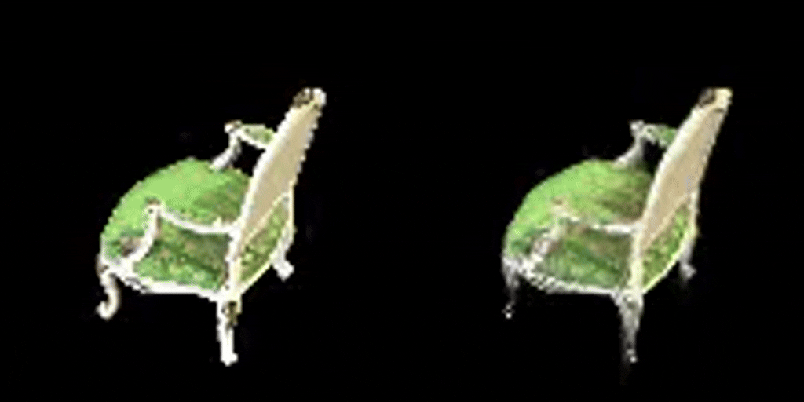
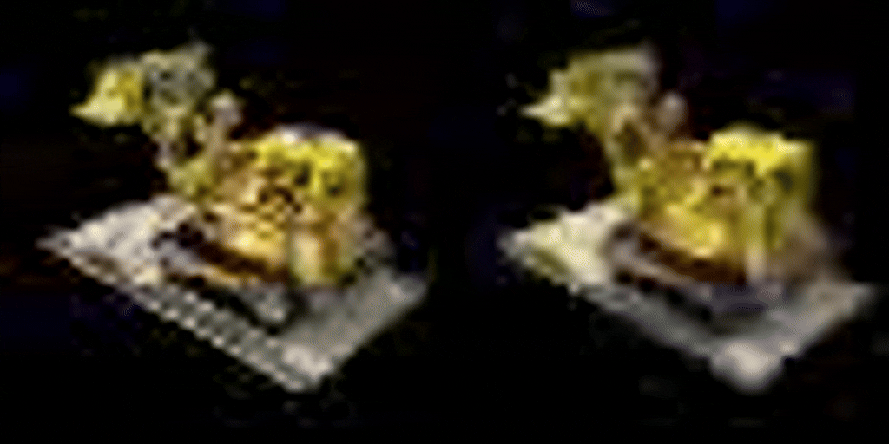

# Assignment 4 - Implement Simplified 3D Gaussian Splatting

This assignment covers a complete pipeline for reconstructing a 3D scene represented by 3DGS from multi-view images. The following steps use the [chair folder](data/chair); you can use any other folder by placing images/ in it.


### Installation
First, you need to install the [COLMAP](https://github.com/colmap/colmap/releases) library. It is recommended to install version 3.9.1. 

Then install the PyTorch3D library:
```
conda install -c fvcore -c iopath -c conda-forge fvcore iopath
conda install pytorch3d -c pytorch3d
```

### Step 1. Structure-from-Motion
First, we use Colmap to recover camera poses and a set of 3D points. Please refer to [11-3D_from_Multiview.pptx](https://rec.ustc.edu.cn/share/705bfa50-6e53-11ef-b955-bb76c0fede49) to review the technical details.
```
python mvs_with_colmap.py --data_dir data/chair
```

Debug the reconstruction by running:
```
python debug_mvs_by_projecting_pts.py --data_dir data/chair
```

### Step 2. build 3DGS model
After implementation, build your 3DGS model:
```
python train.py --colmap_dir data/chair --checkpoint_dir data/chair/checkpoints
```

### Results

[The chair model]
[The lego model]
